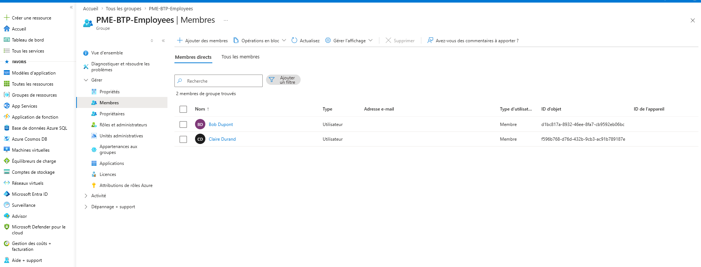

# 🔐 Azure Tenant Security — SMB Use Case

> **Simulated freelance project** — Mission type: securing a Microsoft 365 / Azure tenant 
> for a 60-person construction company (Centre-Val de Loire) following an intrusion attempt.

---

## 🎯 Client Context

| | |
|---|---|
| **Industry** | Construction — 60 employees |
| **Region** | Centre-Val de Loire, France |
| **Problem** | Intrusion attempt on Microsoft 365 — unsecured access |
| **Need** | Mandatory MFA, geo-blocking outside France, access governance |
| **Daily rate** | €650–900 / day |

---

## ✅ Deliverables

| Deliverable | Technology | Status |
|---|---|---|
| Entra ID users (Alice, Bob, Claire) | Terraform | ✅ |
| Security groups (Leaders, Employees) | Terraform | ✅ |
| RBAC Contributor / Reader / Billing Reader | Terraform | ✅ |
| Conditional Access — Mandatory MFA | Terraform | ✅ |
| Conditional Access — Geo-blocking outside France | Terraform | ✅ |
| Named Location "France" | Terraform | ✅ |
| Versioned Infrastructure as Code | Git + GitHub | ✅ |

---

## 🏗️ Tech Stack
Terraform · Azure CLI · Entra ID · Git · GitHub · VSCode

---

## 📁 Project Structure

---

## 👥 Identity Governance

### Security Groups

**PME-BTP-Leaders** (Management)

**PME-BTP-Employees** (Staff)

---

## 🔑 RBAC — Role-Based Access Control

| User | Role | Scope |
|---|---|---|
| Alice Martin | Contributor | Subscription |
| Bob Dupont | Reader | Resource Group |
| Claire Durand | Billing Reader | Subscription |

---

## 🛡️ Conditional Access

Two active policies — no Security Defaults, full governance via Conditional Access.

### Named Location — France

Only connections from France are allowed.

---

## 🗂️ Infrastructure as Code

All infrastructure is defined in Terraform, versioned on GitHub, reproducible in 2 minutes.
terraform/dev/
├── main.tf                  # AzureRM + AzureAD providers
├── variables.tf             # Externalized variables
├── entra-id.tf              # Users + Groups
├── rbac.tf                  # RBAC assignments
├── conditional-access.tf    # CA policies + Named Location
└── outputs.tf               # 9 exposed outputs

---

## 💡 Business Value Delivered

| Technical action | Business value |
|---|---|
| Named users + groups | GDPR compliance — every access traced |
| Mandatory MFA | Blocks 99% of credential stuffing attacks |
| Geo-blocking outside France | Reduced attack surface |
| Versioned Terraform code | Disaster recovery in 2 minutes |
| Clean Git history | Audit trail — who changed what and when |

---

## 👤 Author

**Nabil Bouhaigoun** — Azure Freelance Consultant  
📍 Orléans, France  
🔗 [Malt](#) · [LinkedIn](#) · [GitHub](https://github.com/bouhaigoun/projet-pme-btp)